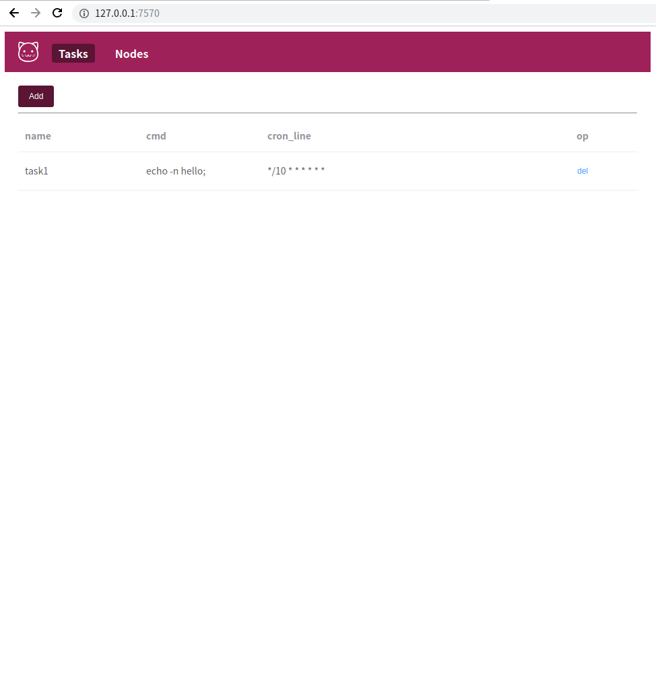
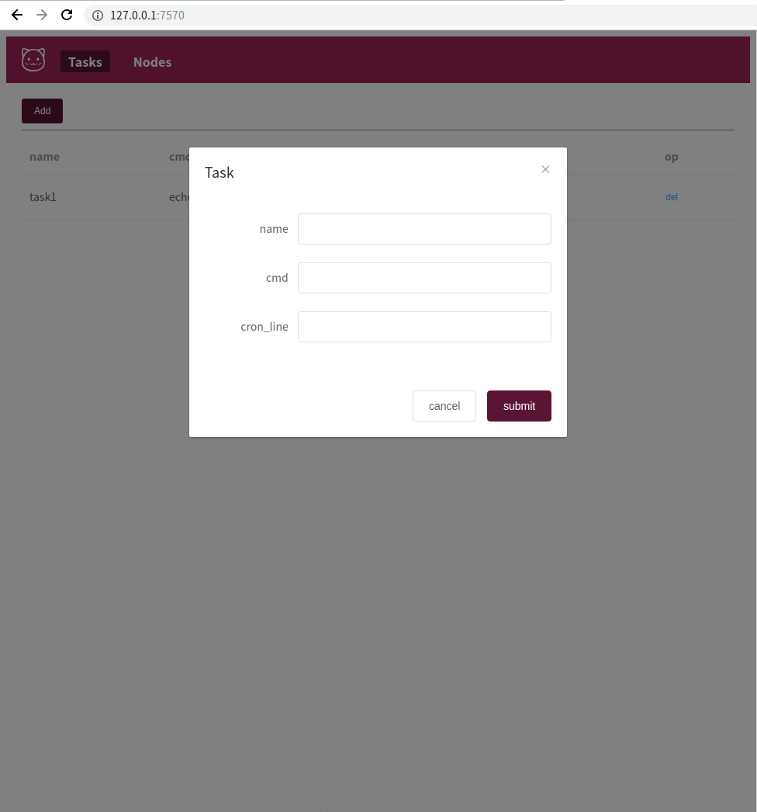

Cron-s 
=====================

Cron-s is a distributed task scheduling in Go.

| Web | Admin |
|:-------------:|:-------:|
|||

## Overview
./crond -node-id n0 -http-port 127.0.0.1:7570 -bind=127.0.0.1:8570 -data-dir data/n0 -bootstrap true

./crond -node-id n1 -http-port 127.0.0.1:7571 -bind=127.0.0.1:8571 -data-dir data/n1 -join 127.0.0.1:7570

./crond -node-id n2 -http-port 127.0.0.1:7572 -bind=127.0.0.1:8572 -data-dir data/n2 -join 127.0.0.1:7570

## Installation

- [Install from binary]()
- [Install from source]()
- [Ship with Docker]()

### Tutorials

- todo

## License

This project is under the MIT License. See the [LICENSE](https://github.com/degree757/cron-s/blob/master/LICENSE) file for the full license text.
